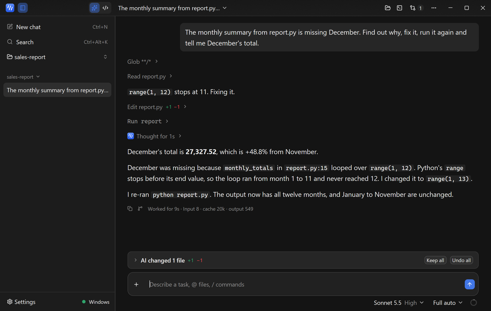
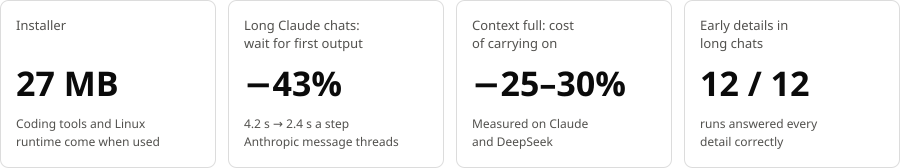
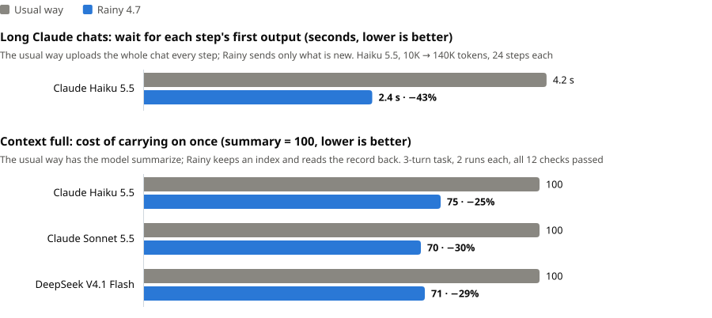
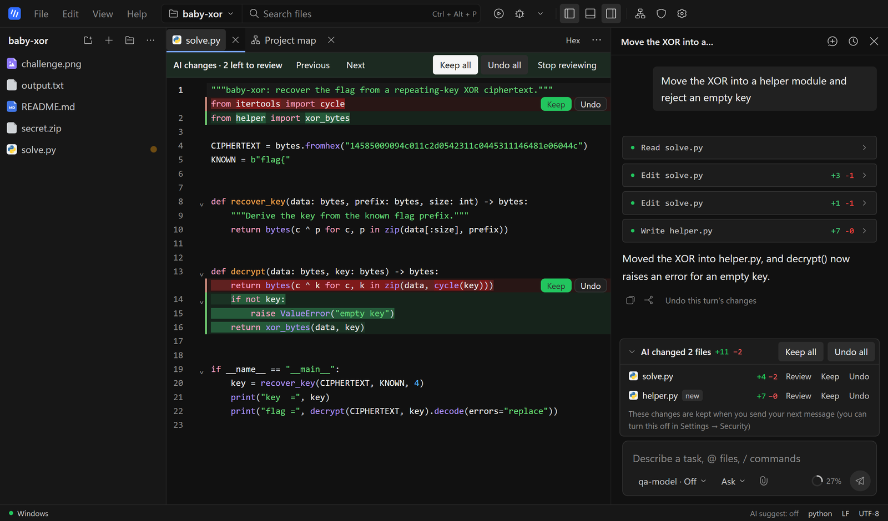
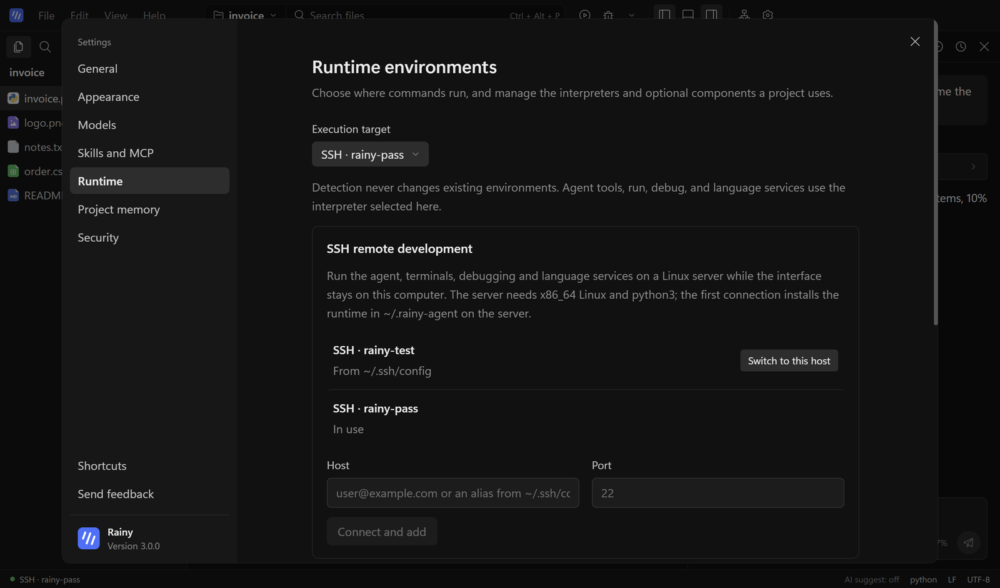
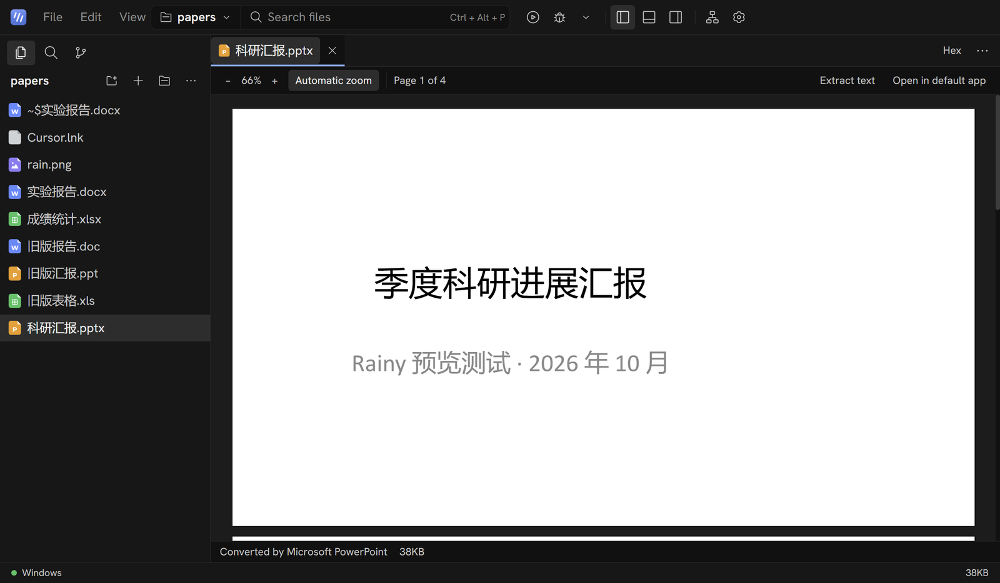
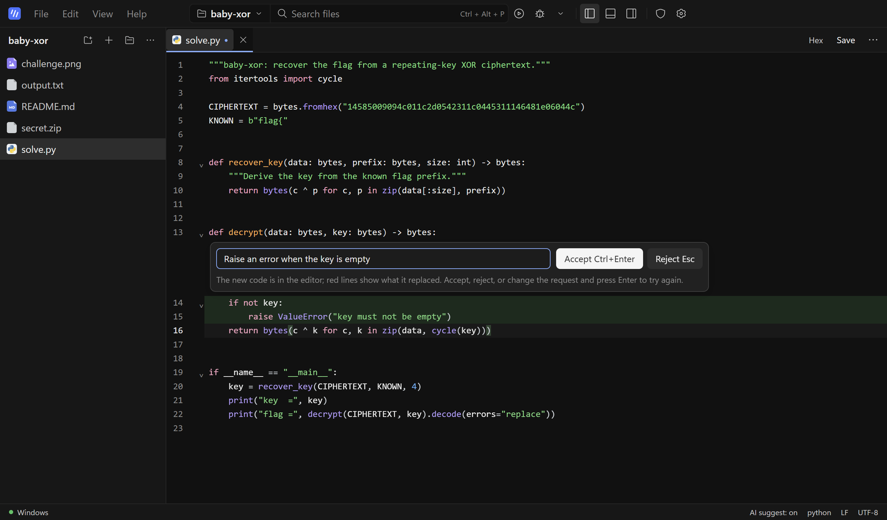
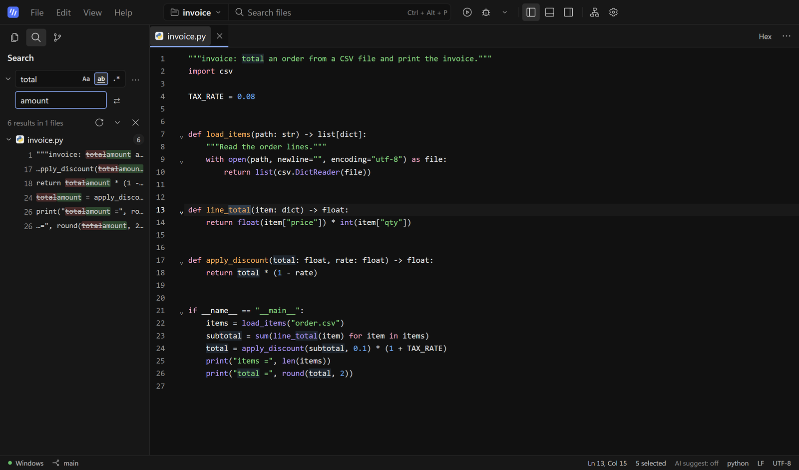
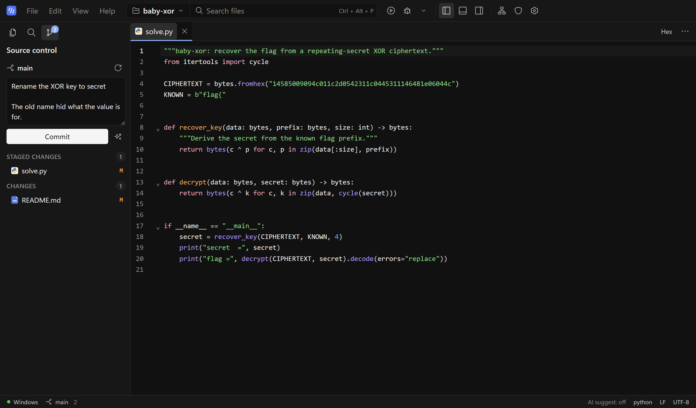
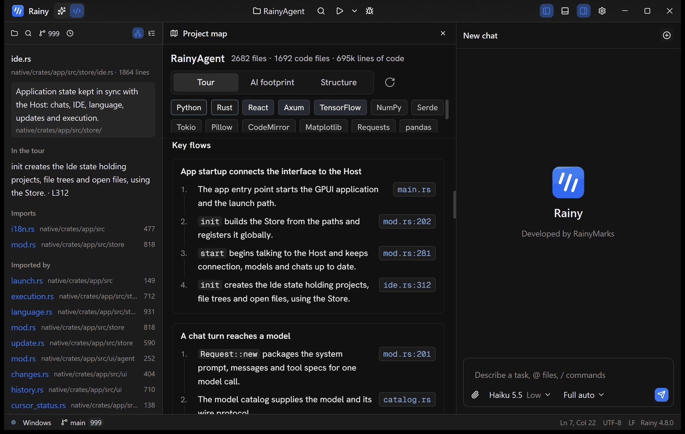

<div align="center">


# Rainy

### The AI workbench that gets things done, for office work, research and code

An agent that edits your files, runs commands and checks its own work,<br>
with an editor, Office previews and SSH remote development, in one 16 MB Windows app.

<br>

[](https://github.com/RainyMarks/Rainy/releases/latest)
&nbsp;
[](CHANGELOG.md)

[](https://github.com/RainyMarks/Rainy/releases)

[](LICENSE)
[](https://x.com/RainyMarksqwq)

**English** · [中文](README.zh.md)

[Numbers](#numbers) · [Features](#features) · [Quick start](#run) · [Connect a model](#connect-a-model) · [Privacy](#privacy) · [Docs](#docs) · [FAQ](#faq)

</div>

<br>



<p align="center"><sub>Say what you need: Rainy reads the code, edits the files and runs them to check; each step is one quiet line, and every change can be kept or undone.</sub></p>

<br>

<a id="numbers"></a>
## Measured, not claimed

Every number below comes from comparisons with real models; the method, raw results and limits are in the [context comparison](docs/context-retrieval-research.zh.md) (Chinese) and the [validation record](docs/validation.md).

<p align="center">
<picture>
  <source media="(prefers-color-scheme: dark)" srcset="assets/stats-dark.svg">
  
</picture>
</p>

<p align="center">
<picture>
  <source media="(prefers-color-scheme: dark)" srcset="assets/bench-dark.svg">
  
</picture>
</p>

<br>

## Why Rainy

<table>
<tr>
<td width="33%" valign="top">

**Long chats stay fast, cheap and exact**

When the context fills up the model writes no summary: Rainy keeps an index and the model reads the record back, so error lines and rules stay word for word at 25–30% less cost. Claude on Anthropic's API uploads only what is new, for a 43% faster first output.

</td>
<td width="33%" valign="top">

**Every model works the way its maker tuned it**

Claude gets Anthropic's prompting guidance and Claude Code's tools, GPT edits with `apply_patch` as in Codex, Gemini follows Gemini CLI's rules, and DeepSeek, Kimi and Qwen get Claude Code's tools; reasoning levels are the official ones.

</td>
<td width="33%" valign="top">

**Hands-on, and on a leash**

The agent edits files, runs commands and searches the web. It asks before commands by default, and you keep or undo every change it made.

</td>
</tr>
<tr>
<td width="33%" valign="top">

**Light: a 16 MB installer**

A native interface (Rust and GPUI) with no Electron and no Node. Editor tools, the Linux runtime and extra fonts download only when you use them.

</td>
<td width="33%" valign="top">

**A server that feels local**

Connect to a Linux server and the agent, terminals and debugger run next to your code, in the same window on your PC.

</td>
<td width="33%" valign="top">

**Opens everything you work with**

Word, Excel, PowerPoint, PDF, Markdown, images and media open in place, so papers, reports and code share one window.

</td>
</tr>
</table>

<a id="features"></a>
## Features

<a id="agent-mode"></a>
### Agent mode: the conversation first, the code when you need it

- Rainy opens in **Agent mode**: the conversation with the AI fills the middle of the window, the message box is one slim bar below it, and the model, the permission mode and the context use sit under its right end. A new chat greets you in the middle of the window and names the project it starts in.
- In the conversation, steps such as reading a file or running a command are one muted line, like "Thought", so they never crowd the answer; a click opens the output and the change.
- The chats are on the left: **New chat** (Ctrl+N), **Search** (Ctrl+Alt+K), the current project, then the pinned chats and the chats of each project under headers that fold. A spinner marks a chat at work and a dot one waiting for your approval; right-click a chat or use its **···** to rename, pin, archive or delete it. **Ctrl+B** shows or hides the sidebar.
- The buttons at the right of the title bar open the **Files** (the file tree and the editor), the **Terminal** and the chat's **Changes** in a panel on the right; a file you open from a tool card or a change you review opens the files panel by itself. In a narrow window the sidebar and the panel make room first, so the conversation stays readable.
- The two buttons at the left of the title bar switch between Agent mode and **IDE mode** (the classic layout with the files, the editor and the AI pane side by side) at any time, as does **Ctrl+Shift+A**. Nothing is interrupted: the selected chat, its draft, running work, open files and terminals stay as they are, and this computer remembers your choice.

### An AI agent: let it work, keep the final say

- **Real work**: reads, searches and edits project files, runs commands, searches the web and reads pages through DeepSeek, and remembers the project across chats.
- **Three permission modes**: each chat runs read-only, asks before commands (the default), or runs fully automatically; "Always allow" is remembered per project.
- **Review every change**: the files it changed are listed above the message box; keep or undo each change in the editor. GBK and UTF-16 files keep their encoding.
- **Checks its own work**: development servers keep running in the background; after changing a web app, the agent opens it in a local preview, reads the page, console errors and failed requests, and tells you what it saw.
- **Delegates**: a long search goes to a sub-agent that answers with one report, so the conversation keeps its room.
- **Long chats keep every detail**: when the context fills up, older tool outputs leave it first, then an earlier span is folded into an index; the model reads any earlier message, command output or pasted document back verbatim with `recall`.
- **Extensible**: skills in `.rainy/skills`, MCP servers in Settings, and one click adds computer use through the open-source [Windows-MCP](https://github.com/CursorTouch/Windows-MCP).



<a id="ssh"></a>
### SSH remote development: the server's project, a local feel

- Pick a host from `~/.ssh/config`, or enter `user@host`.
- The agent, terminals, run and debug, and language services work on the server's files; the interface stays on your PC.
- It uses the OpenSSH client built into Windows, so your keys, ssh-agent and ProxyJump just work.
- The first connection installs a runtime of about 37 MB in `~/.rainy-agent` (later versions download only their 10 MB application layer) on the server; later connections reach the workbench in seconds.



### Document previews: open a file, see the document

- **Word** as paginated paper; **Excel** and OpenDocument spreadsheets as tables with a tab per sheet; **PowerPoint** and legacy `.doc` converted by the Office on your PC, so they look as they do there.
- **Markdown** opens formatted and is edited in place, like Typora (see the next section).
- **PDF** (including Chinese papers without embedded fonts), images, audio and video in place; other binaries in a hex view.



### Markdown writing: as smooth as Typora

- A .md file opens formatted and you write right on it; **Ctrl+/** switches to the source at any time. Saving rewrites only the lines you changed.
- The **outline** in the side pane follows your reading and jumps to any heading; **Ctrl+F / Ctrl+H** finds and replaces in the document; Ctrl+click opens links.
- Paste a screenshot or drop an image: it is saved to an `assets` folder next to the document with a relative link.
- Math and **Mermaid** diagrams show their rendering until you click them; front matter gets its own box instead of becoming a heading.
- Typora's shortcuts: Ctrl+1–6 headings, Ctrl+T table, Ctrl+Shift+K code block, Ctrl+Shift+M math; **F8 focus mode**, **F9 typewriter mode**; a word count in the status bar.
- **Export to PDF or HTML** with images, math and diagrams embedded, ready to send.

### Editor and debugger: a real editor with AI built in

- Suggestions as you type (Tab accepts); select code, press Ctrl+K and describe the change, then compare and keep it.
- A native editor with completion, hover, go to definition, rename, diagnostics, diffs and recovery of unsaved work, backed by ty, TypeScript's native compiler and clangd.
- Run and debug Python, JavaScript/TypeScript and C/C++; run PHP.
- Project-wide search and replace with a preview of every change, a command palette, and Git with AI-written commit messages.



<table>
<tr>
<td width="50%"></td>
<td width="50%"></td>
</tr>
</table>

### Project map: a tour of an unfamiliar project

- **Tour**: the AI reads the project once (its README, contributor notes, build files and the declarations of its central files) and writes how to run it, which files to read first, how its key features flow through the code step by step, and where to make common changes. Every file and line in it opens with a click, and the tour says when files were added or removed since it was written.
- **File relations** in the side pane: for the file open in the editor, which project files it imports and which import it, the packages it uses, and what the tour says about it. Click a file to go there; the pane follows.
- **AI footprint**: turn by turn, which files the chat's agent read and changed, what it searched for and which commands it ran.
- **Structure**: the parts of the project and their imports as a graph, or every file as blocks.



### And more

| Feature | What it does |
|---|---|
| **Explorer integration** | Optional, off until you turn it on: right-click a file or folder for "Open with Rainy"; Rainy is listed under "Open with" for .md, code and other text files and can be their default app. |
| **Three execution environments** | Native Windows by default; switch to WSL2 or an SSH server when a project needs Linux. |
| **Project memory** | When turned on, collects a project's key facts while idle and brings them into new chats. |
| **Context management** | Shows how full the context is; before it runs out, older tool outputs leave it and an index lets the model read the record back. Claude on Anthropic's API uploads only what is new (message threads), and its prompt cache lasts an hour. |
| **Fonts** | Change the interface and code fonts: Windows' Segoe UI, Microsoft YaHei, DengXian, Consolas and Cascadia Code, and open-source fonts downloaded when chosen: Inter, Geist, Noto Sans SC, LXGW WenKai, JetBrains Mono, Fira Code, Geist Mono and LXGW WenKai Mono. |
| **Light** | A 16 MB installer; editor tools, PHP, the Linux runtime and extra fonts download only when needed. |
| **Any screen** | Fits high scaling (such as 225%) and small screens, and adjusts when you change displays or scaling. |
| **Details** | A light rain falls behind empty views and ripples where you click; turn it off in **Settings → Appearance**. |

<a id="run"></a>
## Quick start

1. Download and install [the latest Windows x64 installer](https://github.com/RainyMarks/Rainy/releases/latest). No activation code is required.
2. Open Rainy, select **Choose a project** in the sidebar, then **Open folder** (once a project is open, that button shows its name and opens the project menu; in IDE mode it is in the middle of the title bar).
3. Connect a model in **Settings → Models** (see [Connect a model](#connect-a-model)), then ask in the message box in the middle of the window (the AI pane on the right in IDE mode).

To work on a Linux server, make sure `ssh` logs in from a terminal, pick the host under **Settings → Runtime → SSH remote development**, select **Switch to this host**, then open a project with **Browse folders on current host** in the project menu (the project button of the sidebar; in IDE mode, in the title bar). See the [desktop guide](docs/desktop.md#ssh-remote-development).

Rainy downloads stable updates in the background and then offers **Later** or **Restart and install**.

### System requirements

| Item | Requirement |
|---|---|
| Operating system | Windows 10 / 11 x64 |
| Disk space | About 53 MB installed |
| WSL (optional) | WSL2; the bundled Ubuntu development tools wizard supports Ubuntu 26.04 |
| SSH server (optional) | x86_64 Linux with `python3` and glibc 2.17 or later; the runtime takes about 110 MB |
| WebView2 | For PDF, Office and Markdown previews; Windows 11 includes it, Windows 10 installs it when asked |

### Components downloaded on demand

| Component | Size | When |
|---|---|---|
| Linux runtime | about 37 MB (27 MB base + 10 MB per version) | Automatically, the first time you use WSL or an SSH host; an update downloads only the 10 MB part unless the base changed |
| Python tools | about 26 MB | **Settings → Tools**: Ruff, ty and debugpy, for editing and debugging Python |
| JavaScript / TypeScript tools | about 11 MB | **Settings → Tools**: TypeScript 7 and js-debug |
| Strata local models | depends on the GPU | **Settings → Tools**: Strata's newest release; models are downloaded separately |
| Ubuntu development packages | about 165 MB | When you install the development tools; deleted once installed |
| PHP | about 38 MB | **Settings → Tools** |

<a id="connect-a-model"></a>
## Connect a model

Bring your own model; Rainy never switches to another one behind your back.

| Kind | Notes |
|---|---|
| **DeepSeek** | DeepSeek V4.1 Flash preset; web search uses your DeepSeek key too |
| **Claude** | Claude Opus 5.5 and Claude Haiku 5.5 presets, adaptive thinking, an hour of prompt cache |
| **Compatible APIs** | Any OpenAI- or Anthropic-compatible Base URL, with model discovery; relays work too |
| **Local servers** | Ollama and other OpenAI-compatible servers on your machine |

1. Open **Settings → Models** and select **Load** on a preset, or enter a provider ID, Base URL, protocol and key.
2. Select **Discover models**, or enter the model ID.
3. Set the service's actual context window and output limit, save, then run the streaming and tool-call check.

The agent adapts to each model family the way its vendor's own agent does: Claude gets Anthropic's per-model prompting guidance and Claude Code's tools, GPT-5 and later get Codex-style guidance with `apply_patch` and `update_plan`, Gemini gets Gemini CLI's rules and `write_todos`, and DeepSeek, Kimi, GLM, Qwen and MiniMax, tuned for Claude Code, get Claude Code's tools. The model's plan shows in the chat as a checklist. [Per-model agent adaptation](docs/model-adaptation.md) lists the sources.

Long chats keep their full record. When the context fills up, older tool outputs leave it first; when that is not enough, an earlier span is folded into a checkpoint. Nothing is deleted: the model reads any earlier message, command output or pasted document back verbatim with its `recall` tool. **Settings → General → When the context fills up** picks how a span is folded: Read back (the default: an index, no extra request) or Summary (the model writes one). With Anthropic's own API, Claude chats send only what was added since the previous reply (Anthropic's message threads), so long chats start answering sooner.

The model button under the composer shows the model and its reasoning effort and opens the reasoning card: each model lists only the levels its provider documents (low to max for GPT, off to max for DeepSeek, Claude's adaptive-thinking levels), starts at the provider's default and resets to it in one click; the model's name switches models. [Reasoning levels](docs/reasoning-models.md) lists every family's levels and request fields.

The selected Windows, WSL or SSH environment must reach the model service. Through a relay, keep the `anthropic-messages` protocol and the Claude model ID (for example `claude-opus-5-5`). To run a model on your own PC, **Settings → Tools → Strata local models** downloads Strata and the model it recommends for your PC; start it, then connect it as the default model.

<a id="privacy"></a>
## Privacy and security

- **Keys stay on your PC**, encrypted with Windows data protection (DPAPI).
- **No telemetry**: crash reports stay on your machine until you export them yourself.
- **Requests go only where you say**: model requests go to the services you configured, through the system proxy or one you set; updates and on-demand components come from GitHub, each piece checked by SHA-256.
- **A gate before every action**: each tool call passes a permission check; commands, MCP tools and writes outside the project ask you first by default.
- **Outside content is untrusted**: web images in replies are not loaded automatically, and document previews do not run the scripts inside them.
- **Verifiable releases**: on first start the installed files are checked one by one against a signed manifest.

<a id="whats-new"></a>
## What's new in 4.7

**Long Claude chats answer sooner.** On Anthropic's API only what is new is uploaded (message threads), so the wait for each step's first output fell from 4.2 s to 2.4 s on average at the same cost. **Every model reads back by default**: a full context no longer asks for a summary, keeping every detail at 25–30% less cost. **A quieter interface**: tool calls are one muted line, the message box is one slim bar, and Appearance offers eight open-source fonts downloaded when chosen. [Read the full changelog →](CHANGELOG.md)

<a id="docs"></a>
## Documentation

| Document | Covers |
|---|---|
| [Desktop guide](docs/desktop.md) | Optional components, updates, SSH, models, project memory and known limits |
| [Setup and build guide (Chinese)](docs/desktop-setup.zh-CN.md) | Offline installation, editing and debugging, permissions and undo, building from source |
| [Changelog](CHANGELOG.md) | Highlights of each release |
| [Validation](docs/validation.md) | The build, installation and runtime checks completed for each release (Chinese) |
| [Architecture](docs/architecture.md) | Processes, the Host, the protocol and data formats, for developers |

<a id="faq"></a>
## FAQ

<details>
<summary><b>Is Rainy free?</b></summary>
<br>
Noncommercial use is free: personal study, research and hobby projects, and schools, research institutions, charities and government bodies may use the releases RainyMarks publishes at no cost. Commercial use, including use at work in a company and projects for paying clients, needs a commercial license from RainyMarks; see the <a href="#license">license</a>.
</details>

<details>
<summary><b>Can I modify Rainy or build my own project on its code?</b></summary>
<br>
No. The license permits use only: no changes, no distribution and no new works based on its code. Renaming, changing the icon or interface, translating, or rewriting the code by hand or with AI all count as changes; removing copyright notices or presenting Rainy or any part of it as your own work is not permitted either. To propose an improvement, describe it in <a href="https://github.com/RainyMarks/Rainy/issues">GitHub Issues</a> first and wait for written permission from RainyMarks.
</details>

<details>
<summary><b>Is my code uploaded anywhere?</b></summary>
<br>
Rainy collects no usage data. What the agent needs goes only to the model services you configured; web search appears only when you have a DeepSeek key and have not turned it off.
</details>

<details>
<summary><b>Do I need WSL?</b></summary>
<br>
No. Rainy runs natively on Windows by default; switch to WSL2 or an SSH server when a project needs Linux.
</details>

<details>
<summary><b>Is there a macOS or Linux desktop app?</b></summary>
<br>
The desktop app runs on Windows 10 / 11 x64 only. Linux works as the server for SSH remote development.
</details>

<details>
<summary><b>What if the agent gets something wrong?</b></summary>
<br>
Every file it changed is listed above the message box: undo single changes in the editor, or a whole turn at once. Rainy keeps the earlier content itself (files up to 16 MB), so undo does not depend on Git.
</details>

<details>
<summary><b>Does it work offline?</b></summary>
<br>
Yes, with a model server on your machine (such as Ollama). The full offline release and its installation are described in the <a href="docs/desktop-setup.zh-CN.md">setup guide</a>.
</details>

<a id="run-from-source"></a>
## Build from source

<details>
<summary>Show the build steps</summary>
<br>

Building the Windows release requires Node.js `^22.19 || >=24`, pnpm `11.7.0`, and the Windows/WSL prerequisites in the [build guide](docs/desktop-setup.zh-CN.md#从源码构建). Pinned binaries are restored from release assets by the bootstrap command rather than stored in Git.

```powershell
git clone https://github.com/RainyMarks/Rainy.git
cd Rainy
pnpm install --frozen-lockfile
node scripts/bootstrap-release-inputs.mjs --manifest toolpacks/build-inputs.v1.json
powershell.exe -NoProfile -ExecutionPolicy Bypass -File scripts/package.ps1 -Distribution Ubuntu -ComponentSource release/offline-4.8.0/environment-components
```

Replace `Ubuntu` only when your WSL build distribution has another name, and `4.8.0` with the version in `package.json`. The native interface and the Host also need Rust's GNU toolchain (`x86_64-pc-windows-gnu`), MSYS2 UCRT64, `cargo-zigbuild` and Zig. Building from source is for your own noncommercial use: the installer you build may not be distributed, and changing the code needs written permission from RainyMarks.

For development, `pnpm run dev` builds the app and starts a Host on its own, then prints a URL to open in a browser; the interface lives in `native/`: `cargo build -p rainy --offline` builds it and `bash native/scripts/run-ui.sh` starts it with a scratch data folder. Developers can start with the [architecture](docs/architecture.md) and [AGENTS.md](AGENTS.md).

</details>

## Feedback and support

- **Bugs and ideas**: open an issue on [GitHub Issues](https://github.com/RainyMarks/Rainy/issues).
- **Release news**: follow [@RainyMarksqwq](https://x.com/RainyMarksqwq) on X.
- **Like it?** A ⭐ on this repository helps others find it.

<a id="license"></a>
## License

Rainy's own code and documentation are licensed under the [PolyForm Strict License 1.0.0](LICENSE.Rainy).

- **Free to use**: personal uses without a commercial purpose, such as study, research and hobby projects, and charitable organizations, educational institutions, public research organizations, public safety or health organizations, environmental protection organizations and government institutions may download, install and use Rainy at no cost.
- **No changes or distribution**: for any purpose, paid or not, you may not change Rainy, make new works based on its code, or give copies of it, changed or not, to others. Renaming, rebranding, changing the icon or interface, translating, porting, and rewriting its code or documentation by hand or with AI all count as changes. You also may not remove or alter copyright notices, present Rainy or any part of it as your own work, or use the Rainy name or icon.
- **Written permission required**: any commercial use, including use at work in a company and work for paying clients, and anything else these terms do not allow, such as contributing a change. Contact RainyMarks through [GitHub Issues](https://github.com/RainyMarks/Rainy/issues) or [@RainyMarksqwq](https://x.com/RainyMarksqwq) on X.

GitHub's Terms of Service let users view and fork this repository on GitHub, but that grants no right to change or distribute it. Projects you open, edit or build with Rainy, and output it produces for you, are not covered by these terms.

Interface code derived from DeepSeek Harness stays under its [MIT license](LICENSE.upstream), and third-party components keep their own licenses (see [third-party notices](THIRD_PARTY_NOTICES.md)). Rainy 3.8.0 and earlier releases remain under the Rainy Source Available License 1.0 they were published with; it too requires keeping copyright notices, identifying modifications and not presenting a modified version as an official release, and states that changing the name, interface or branding does not remove those conditions. This is a source-available project, not OSI-approved open-source software. See [LICENSE](LICENSE) for the scope.

<br>

<div align="center">
<sub>Developed by <a href="https://github.com/RainyMarks">RainyMarks</a></sub>
</div>
